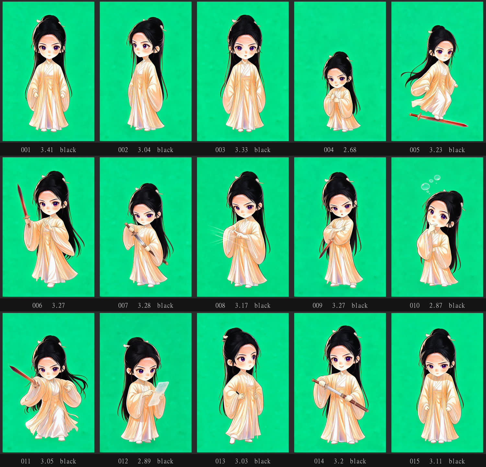

# dsh-yingnan · 蜀山侠女（余英男）

> 仓库：https://github.com/f2x33/dsh-yingnan


*定妆图（杏黄交领外袍 + 白色内衬中衣、赤红长剑、乌黑长发白玉簪；背景已抠成透明，这里贴的是绿幕原图）*

> 蜀山剑侠主题的 **DeepSeek Harness 桌面宠物**。
> 超变形 Q 版：乌黑长发用一支白玉簪松松挽起、几缕碎发垂在脸侧，一身**杏黄交领外袍 + 白色内衬中衣**
> （袖口衣摆淡金云纹、杏黄丝绦、白布云鞋），右手提一柄**赤红长剑**（剑身赤红，剑周围没有火焰与任何发光特效）。
> 定妆图实测 **身高/头宽 = 3.27**（量测用「连续段」口径，见下面「实测教训」第 ① 条）。
> **这是刻意选的档**：更 Q 的两头身（2.1 闸门那一套）试过，用户看过对比后判定「头太大」，
> 最终定为**最初那张豆包原图那一档（3.21）** —— 比父包红队成品（2.0~2.4）更接近正常动漫少女比例。
> 你在 DSH 里干活时她陪着（掐诀参悟 / 御剑突进 / 清点玉简 / 悬剑等授权 / 收剑入鞘 / 剑势被破），
> 闲下来会碎碎念江湖手札；点她、拖她、右键点播动作都照常。动作有 18 段，
> 其中有**御剑飞行**（会真的移动位置）、工作状态-舞剑、拔剑出鞘、御剑突进、
> 剑气斩、御剑腾空、万剑归宗、掐诀画符……

**两个名字，别搞混**（这是有意分开的）：

| 用途 | 值 |
|---|---|
| 包名 / 命名空间 / 路由 / 命令 / 数据目录 | **`yingnan`**（包名 `dsh-yingnan`） |
| 桌面上悬浮提示、设置面板标题、AI 人设里的「你的名字是…」 | **蜀山侠女**（= `assets/config.jsonc` 的 `pets[0].name` 与 `lib/client.js` 里 locale 的 `nav`） |
| 角色本名（工具、文档、提示词里一律用这个） | **蜀山派余英男** |

改命名空间要动路由 / 命令 / 数据目录（有兼容风险）；改显示名只是改文案。

**血统**：本包是从 **`dsh-redpet`** 分叉而来（`dsh-redpet` 自己又是
[dsh-pet](https://github.com/PC2005-cloud/dsh-pet) `0.3.5`（MIT，作者 PC2005-cloud）
构建产物的分叉）。保留上游成熟的渲染与投递机制（双 `<video>` 互切、blob 载入素材、
SSE 状态帧、右键菜单、设置页），把标识整族换掉，并重写人设 / 台词 / 工作状态文案 / 动作池。
**三者完全解耦**：素材、配置、记忆都在各自目录里，关掉或卸载其中一个不影响另外两个，
三只宠物可以同时出现在桌面上。

---

## ⚠ 命名空间隔离（改代码前必读）

DSH 的**命令名**与**浏览器端 UI 槽位 id 是扁平的、没有命名空间**，而这三个包是同源分叉，
一不小心就会重名。下表每一行的「后果」都不是猜的，是这套包在历史上真实炸过的：

| 类别 | dsh-pet 用 | dsh-redpet 用 | **本包必须用** | 重名的后果 |
|---|---|---|---|---|
| 插件名（宿主 / 浏览器半侧） | `pet` | `redpet` | **`yingnan`** | 插件永不激活（`fiberPhase: null`） |
| 命令 | `/pet` `/chat` `/balance` | `/redpet` `/redchat` `/redpet-balance` | **`/yingnan`** **`/yingnanchat`** **`/yingnan-balance`** | `command "xxx" is already registered` → **整个 DSH 启动报错** |
| `shell.overlay` 槽位格子 | `pet` | `redpet` | **`yingnan`** | 两只宠物抢同一格，只显示一只 |
| `settings.section` 区块 | `pet-config` | `redpet-config` | **`yingnan-config`** | 设置页互相顶掉 |
| 命令图标表的键 | `pet` `chat` `balance` | `redpet` `redchat` `redpet-balance` | **`yingnan`** `yingnanchat` `yingnan-balance` | 图标挂不上（键必须与命令名一致） |
| locale 命名空间 | `pet.config` | `redpet.config` | **`yingnan.config`** | 文案字典互相覆盖，标题串味 |
| CSS 类名 | `pet-bub-*` | `redpet-bub-*` | **`yingnan-bub-*`** | 两边样式互相污染 |
| CSS 变量 | `--dsh-pet-size`（桌面用 `--pet-size`） | `--dsh-redpet-size` | **`--dsh-yingnan-size`**（**不要**再写 `var(--pet-size, …)` 兜底） | 尺寸被对方的值污染 |
| 路由前缀 | `/dsh-pet-7340` | `/dsh-redpet-7340` | **`/dsh-yingnan-7340`** | 路由互相覆盖 |
| 用户数据目录 | `$DSH_HOME/dsh-pet` | `$DSH_HOME/dsh-redpet` | **`$DSH_HOME/dsh-yingnan`** | 配置 / 记忆串到一起 |
| **顶层词法声明名**（浏览器 classic script 的全局作用域） | 原样（未包裹） | 已 IIFE 包裹 | **已 IIFE 包裹**（见下节） | 后加载的 bundle 在**解析期**抛 `SyntaxError` → 该插件**永远** import failed |

**保险丝**：宿主半侧的三个命令注册全部走 `registerCommandSafely()`（`lib/index.js`）——
万一将来又撞名，**只跳过那一个命令并打印警告，绝不让插件激活失败、更不会拖垮 DSH**。
（上游 dsh-pet 用的是裸 `ctx.commands.register()`，这正是本包与它的一个重要差别。）

### 🔥 最隐蔽的一类：顶层词法声明名

**机制**：DSH 会把**同一批（batch）的多个插件 bundle 拼成一个 classic script** 下发
（`dsh-client-modules` 的 `buildComboScript`）。classic script 的顶层
`const` / `let` / `function` 落在**全局词法作用域**里。本包是从上游
**构建产物**分叉的，两份 bundle 的顶层声明名**几乎全部同名** ——
后加载的那份会**还没执行一个字节**就抛
`SyntaxError: Identifier 'xxx' has already been declared`。
更坑的是：解析失败但 `<script>` 的 `load` 事件照样触发，不算 transport 失败；
而启动路径 `ClientEntries.start()` 只调 `loader.create()`、不走 `modules.import()`，
错误进不了 `importErrors` → 前端只显示一句 `import failed (see console for the import error)`，
打开 console 也未必看得出是解析错误。

**修法**：把整个客户端 bundle 原样包进 IIFE（`tools/_wrap-iife.mjs`），顶层声明全部降为
**函数作用域**。契约不变（仍是一次 `window.__ModuleLoader__.load({id, factory})`），
**不加 `"use strict"`**（避免改变原产物的 `this` / 静默失败语义），
前导 `;` 独占一行（防 ASI，也防被上一个 bundle 末尾的 `//` 行注释吞掉）。
脚本是**幂等 + 自愈**的：已经包裹过会先剥掉再重新包。

**本包现状（实测）**：

- `lib/client.js` 第 1-2 行就是包裹头：`/* dsh-yingnan: IIFE 包裹 … */` + `;(function(){`
- `node --check lib/client.js`、`node --check lib/index.js` 均通过
- `node tools\verify-coexist.mjs`：**两种加载顺序都注册成功**
  （`dsh-pet 先 / 本包后` 与 `本包先 / dsh-pet 后`，注册结果都是 `dsh-pet, dsh-yingnan`）
- 把 `dsh-pet` / `dsh-redpet` / `dsh-yingnan` / `dsh-pet-forge` 四份 bundle 按
  **三种不同顺序**拼成一个 classic script，`node --check` **全部通过**

**⚠️ 重新构建 / 再次改名后必须按序重跑**（本包没有 `src/`，`lib/*.js` 是手工维护的产物）：

```powershell
node tools\_rename-yingnan.mjs    # ① 标识统一为 yingnan（本包已跑过）
node tools\_wrap-iife.mjs        # ② IIFE 包裹（幂等，可反复跑）
node tools\verify-coexist.mjs    # ③ 回归测试，必须全绿
```

**⚠️ 改名脚本绝不能碰「外部标识」**：`_rename-yingnan.mjs` 是**全局替换**，历史上就出过
「把发布目标仓库名一起改掉、而那个仓库并不存在」的事故 ——
**残留扫描在原理上抓不出「改多了」**，唯一有效的防线是**替换前**把不能碰的字符串摘出来。
所以脚本里有一张 **PROTECT 保护表**：替换前把外部标识换成 NUL 占位符、规则跑完再还原，
并逐个校验数量必须一字不差，不符就中止且**一个文件都不写**。当前保护：

| 外部标识 | 是什么 |
|---|---|
| `f2x33/redteam-pet-desktop` | 姊妹项目 `redteam-pet-desktop` 的 GitHub 仓库 |
| `f2x33/redpet` | **父包 dsh-redpet 的** GitHub 仓库（本包不得冒用） |
| `f2x33/redteam-pet` | 父包的旧仓库名（历史记录里会提到，保住原样） |
| `PC2005-cloud/dsh-pet` | 上游 dsh-pet 的仓库署名 |

**通用结论（对所有 dsh-pet / dsh-redpet 分叉都成立）**：只要一个包是从另一个已装插件的
**构建产物**分叉出来的，就必须 IIFE 包裹，否则同批加载时必然解析冲突。
更根本的修法在上游：`dsh-client-modules` 的 `buildComboScript` 拼接时应该给**每个**插件源码
各包一层 IIFE。

---

## 〇、姊妹项目：独立桌面版（不依赖 DSH）

同一只蜀山侠女也做成了**双击就能跑的 Electron 桌面宠物** —— 透明置顶窗 + 同一套 18 段素材
+ 74 条台词 + 本地接入口（POST /state {state:idle|thinking|working|error|done}，任何框架都能驱动它）：

- 仓库：https://github.com/f2x33/yingnan-pet-desktop
- 与插件版**共用素材、互不依赖**：这边卸载、那边照跑，反之亦然
- 素材改动后跑它的 `node tools\sync-assets.mjs` 同名覆盖即可，配置一个字不用改


*桌面版实拍（`POST /debug/capture` 截的真窗口）：透明置顶窗、无边框，背景真透明。*

---

## 一、18 个动作

| # | 动作名（素材文件名，逐字一致） | 定位 | 触发时机 |
|---|---|---|---|
| 001 | `待机呼吸休闲` | 待机 | 空闲待机，循环播；**空手站立（不握剑、不持道具）** |
| 002 | `东张西望` | 转向 | 随机链的 turn 档（播完会翻转朝向），右键可点播 |
| 003 | `被鼠标拖拽悬空反馈` | 拖拽 | 被拖拽时（**正常站立、双脚着地**） |
| 004 | `点击回应-抱拳行礼` | 点击回应 | 点一下宠物（clicks 池目前只有它，即固定播它） |
| 005 | `御剑飞行` | **位移** | `moves.actions` 里唯一一条；会**真的改变宠物位置** |
| 006 | `工作状态-舞剑` | **工作状态 1** | `tool/call` 工具调用中（舞剑看着更有劲） |
| 007 | `拔剑出鞘` | 随机小动作（剑舞 25） | 随机链 |
| 008 | `掐诀画符` | 随机小动作（修行 12） | 随机链 |
| 009 | `碎碎念-对剑自语` | 碎碎念 | 到点碎碎念时（与 `工作状态-掐诀参悟` 随机抽 1） |
| 010 | `工作状态-掐诀参悟` | 工作状态 0 | `turn/start` 回合开始（思考） |
| 011 | `御剑突进` | 随机小动作（剑舞 25） | 随机链 |
| 012 | `工作状态-清点玉简` | 工作状态 2 | `tool/result` 工具返回（出结果、整理） |
| 013 | `工作状态-原地踱步张望` | 工作状态 3 | `approval/asked` 等你授权（挂起） |
| 014 | `工作状态-收剑入鞘` | 工作状态 4 | `turn/end completed` 回合完成 |
| 015 | `工作状态-垂头叹气冒汗` | 工作状态 5 | `turn/end error` / 达上限 |
| 016 | `剑气斩` | 随机小动作（剑气 25） | 随机链；横斩出一道**半透明弧形剑气** |
| 017 | `御剑腾空` | 随机小动作（剑阵 18） | 随机链；踏剑**悬停半空** |
| 018 | `万剑归宗` | 随机小动作（剑阵 18） | 随机链；**5 柄半透明剑影环绕回旋** |



*18 段动作的静帧总览（每格标了编号与实测身高/头宽比）。这些静帧是视频的首帧，绿幕，**眼睛是紫瞳**（只改了头发为黑，瞳色未动）。*

> 早先有四个动作被砍掉、素材未再生成：`点击回应-剑花轻挽`、`抱剑而立`、`凌空画符`、`手札记录`
> （理由：点击回应留 1 个够用；抱剑而立是静态姿势；凌空画符与掐诀画符重复；玉简已在「清点玉简」里用过）。
> 想加回来：生成同名素材 → 填进配置对应池子即可。

**权重账**：`idle 10 + turn 5 + move 5 + 随机分类 80（剑舞 25 + 剑气 25 + 剑阵 18 + 修行 12）= 100`。

**命名约定（别乱起名）**：挂 `events.workStatus` 档位的动画一律带 **`工作状态-`** 前缀，跑随机链的不带。
所以「舞剑」进了工作档就叫 `工作状态-舞剑`，「突进」被换到随机池就叫 `御剑突进` ——
名字在**提示词段头 = 静帧 = 原片 = webm（out / 包内 / 用户目录） = 配置池的键** 必须逐字一致，
差一个字的表现是「右键菜单里有名字，点了没反应（404）」。

**衣摆物理**（提示词口径，视频生成时要守住）：静止姿势（待机 / 参悟 / 等待）里**衣摆、丝绦、长发自然垂落、无风自飘**；
只有真的在动时才飘 —— 御剑飞行向后飘、舞剑 / 拔剑 / 突进 / 挥手随动作扬起。

**工作状态是「索引即档位」的定长 6 档，顺序不能乱**：
`0 思考 / 1 工作 / 2 出结果 / 3 等确认 / 4 成功 / 5 出错`。
本版 6 档**各配一个专门动画**（一一对应，不再复用）。**新档只可追加到末尾**，不能中间插入。
（工具侧另有一个独立的语义映射实现见 `dsh-pet-forge` 的 `lib/index.js` 里 `WS_SLOTS`，
那是工坊自己装包时用的，与本包运行时不冲突。）

**位移动作与 `fixedEnabled`**：`御剑飞行` 写在 `animations.moves.actions` 里
（`minDist 120 / maxDist 360`），它**不在随机分类池里**。因为要让它生效，
`pets[0].fixedEnabled` 设成了 **`false`** —— 随机链会抽「转向 / 移动」，她会自己换朝向、
偶尔踩着剑滑到别处。**不想让她乱飞**：把 `moves.actions` 清空（空数组合法，消费端会回落到
随机小动作），或把 `fixedEnabled` 改回 `true`。

**余额功能**：关闭（`pets[0].balanceEnabled: false`）——
本版没有余额系列的 6 段动画，`events.balance` 只留了 1 个占位（校验要求该键存在且非空）。
以后补齐 6 段余额动画，改成 6 档即可。

**表情包**：两个开关默认都关（`whisperImageEnabled` / `chatImageEnabled` = `false`）——
包内 `assets/memes/` 那 27 张是**父包的女仆装版本**（同一个蓝毛角色），开着会串味。
以后换成余英男自己的表情包再打开。

---

## 二、安装

### 0. 前置

- DSH `0.2.0-rc.1` / `0.2.0-rc.2`（见 `package.json` 的 `dsh.compatibility`）
- Node.js ≥ 22.12（见 `engines`）

### 1. 建依赖解析链接（**从源码目录开发时才需要**）

本包放在 profile 目录**之外**（例如 `D:\2.dsh\1.红队版数字人\dsh-yingnan`）。
Node 的 ESM 解析规则是「从文件所在目录往上找 `node_modules`」，所以 `lib/index.js` 里
`import { resolveDshHome } from '@deepseek-ai/dsh-home-paths'` 永远找不到包，插件会以
`failed to import` 挂掉。

解法：在包目录里放一个 `node_modules`，里面 3 个 junction 指回 profile：

```
dsh-yingnan\node_modules\
├─ @deepseek-ai       -> %USERPROFILE%\.dsh\profiles\node_modules\@deepseek-ai
├─ @electron          -> %USERPROFILE%\.dsh\profiles\web\node_modules\@electron
└─ @electron-internal -> %USERPROFILE%\.dsh\profiles\web\node_modules\@electron-internal
```

一条命令搞定（脚本会识别 junction 与残留目录，只摘链接、不跟进目标）：

```powershell
powershell -ExecutionPolicy Bypass -File "D:\2.dsh\1.红队版数字人\dsh-yingnan\tools\fix-node-modules.ps1" -Pkg "D:\2.dsh\1.红队版数字人\dsh-yingnan"
```

脚本最后会真的 `import` 五个运行时依赖来验收；看到 `resolution OK` 才算过。

> 从 npm 安装（pack 成 tgz 再 `install_bundle`）的普通用户**不需要**这一步 ——
> 那时包会落在 profile 的 `node_modules` 里，依赖由 pnpm 装好。

### 2. 挂进 DSH

**本机已经接好了**（profile `web`）：

- `$DSH_HOME\profiles\web\package.json`：`dependencies` 里有
  `"dsh-yingnan": "link:D:/2.dsh/1.红队版数字人/dsh-yingnan"`，
  `dsh.profile.bundles` 里有 `dsh-yingnan`
- `$DSH_HOME\profiles\web\pnpm-lock.yaml`：有对应的 `link:` 条目
- `$DSH_HOME\profiles\web\node_modules\dsh-yingnan`：指向包目录的 **junction**

在新机器上安装走：

```powershell
dsh plugin --profile web install D:\2.dsh\1.红队版数字人\dsh-yingnan
```

**插件行由包自己插。** 本包的 `cordis.patch.yml` 不是空数组，它 insert 自己：

```yaml
- insert:
    - id: dsh-yingnan
      name: 'dsh-yingnan'
```

**⚠ 不要再往 profile 用户层（`$DSH_HOME\profiles\web\cordis.patch.yml`）手写插件行** ——
两边都 insert 会追加出**两只宠物**（`insert` 是追加、不按 id 去重）；
而且 `dshmarket` 会重写用户层，手写条目会被抹掉。

### 3. 停用 / 启用 / 卸装

| 想干什么 | 怎么做 |
|---|---|
| 临时不显示 | 配置里把 `pets[0].display` 改成 `"none"`（刷新即生效） |
| 整包禁用 | 插件管理器里关掉，或用户层加 `- id: dsh-yingnan` + `disabled: true` |
| 彻底摘掉 | `dsh plugin --profile web remove dsh-yingnan`，并删掉 profile 里那条 junction / bundles 项 |

### 4. 验证

**⚠ bundle 层是 DSH 启动那一刻的快照 —— 装了 / 改了 `lib/` 必须重启 `dsh web`。**
重启后按一次 **Ctrl+F5** 强刷。

一条命令全验收（只读、不花钱）：

```powershell
node tools\verify-live.mjs
```

它检查三件事，并对失败给出具体原因：

| 检查 | 说明 |
|---|---|
| `/config`、`/state` 返回 200 | 宿主半侧挂上了 |
| `/plugins/dsh-yingnan/client.js` 返回 200 | **浏览器半侧登记了** —— 这一项**只在 DSH 启动时**扫描，没有重扫入口，所以必须重启过 DSH |
| 配置里引用的每一段素材都能取到 | 并告诉你哪几段来自**用户目录**、哪几段还是**包内**（按 HTTP 返回长度与两个目录比对） |

不上 DSH 也能做的四个自检：

```powershell
node tools\selftest.mjs          # 配置 ↔ 素材：JSONC 解析 / 池子结构 / 权重账 / 文案 / pets / 名字逐字对齐
node tools\verify-coexist.mjs    # 与 dsh-pet 的顶层声明共存回归（必须全绿）
node tools\test-menu.mjs         # 右键菜单：一级只列 menu.flat 那 10 项、「更多」兜底不漏动作、不写时向后兼容
node tools\gh-status.mjs         # 远端仓库体检（只读）：文件树 vs 本地清单是否严格一致 + 最近提交
node tools\measure-alpha-quality.mjs   # alpha 质检：边框带必须全透明 + 内部半透明占比（脏 alpha 会露）
node tools\measure-material-fit.mjs    # 素材一致性：逐段量人物身高/站位，看波动有多大
```

> `test-menu.mjs` 会把 `lib/client.js` 里的 `buildMenuTree` / `buildGroupNodes` 抽出来在 Node 里跑，
> 用**真实配置**断言「紧凑菜单」的三件事：一级恰好 10 项、顺序与 `animations.menu.flat` 一致、
> 全部动作名仍然点得到。改了菜单相关代码就跑它 —— 不用开浏览器。
>
> `gh-status.mjs` 是发布后的核对工具（要 `GH_TOKEN`，细粒度令牌只需 Contents **读**权限）：
>
> ```powershell
> $env:GH_TOKEN = "github_pat_xxx"
> node tools\gh-status.mjs                                   # 体检默认仓库
> node tools\gh-status.mjs --repo f2x33/yingnan-pet-desktop  # 体检别的仓库
> ```
>
> 它会同时报出「本地有、远端没有」（漏发）与「远端有、本地没有」（残留）—— 后者是
> `gh-publish` 那个 `base_tree` 合并语义的坑（**删掉的文件不会自己从远端消失**，要 `--full`）。

手动等价命令（必须带 `Origin`，否则会被 DSH 的浏览器信任检查挡成 401）：

```powershell
Invoke-WebRequest "http://127.0.0.1:3080/dsh-yingnan-7340/config" -Headers @{Origin='http://127.0.0.1:3080'} -UseBasicParsing
```

---

## 三、素材怎么来（现在是真实视频素材）

**✅ 现状**：包内 `assets/webm/` 与用户目录里的 **18 段都是真实视频素材** ——
由 `tools/make-placeholder.mjs` 从定妆图**静态抠像**生成：每段只是同一张立绘加一点
不同的上下浮动（正弦，周期整除时长以便无缝循环），**画面不会真做动作**。
目的是让整条链（素材名 / 尺寸 / alpha / 动作池 / 渲染）先跑通。**真素材尚未生成。**

实测（18 段逐段过闸门）：`640×360` / VP9-alpha / **边框带 100% 透明** / **内部半透明 ≤2.8%** / 绿边 0px /
合计 **24.2 MB**（25 350 906 字节）。素材做过**身高归一化**，见下节。

真素材的流水线（**同名覆盖**即可，配置一个字都不用改）：

```
docs/01-定妆图提示词.md      ① 先出「余英男定妆图」→ out/定妆图.png
        ↓                      比例闸门：node tools/measure-proportion.mjs out/定妆图.png（身高/头宽 ≤ 2.1）
docs/02-动作提示词.md        ② 每段两步：图生图（绿幕静止帧）→ 图生视频（10 秒绿幕视频）
        ↓                      · 全自动：node tools/gen-api.mjs --probe --go          （先验通路）
        ↓                                node tools/gen-api.mjs --only 舞剑 --still-only --go  （只出图，¥0.2/张）
        ↓                                node tools/gen-api.mjs --limit 2 --go        （验收 2 段）
        ↓                                node tools/gen-api.mjs --all --go            （全量，必须显式加 --all）
        ↓                      · 手动：把提示词整段复制进豆包/即梦，下载视频丢进 out/raw/
out/raw/*.mp4                绿幕原片
        ↓  node tools/keyscreen.mjs --in out/raw --out out/webm
out/webm/*.webm              640×360 VP9-alpha 透明视频
        ↓  node tools/pipeline.mjs      （拷进用户素材目录 + 体检）
$DSH_HOME\dsh-yingnan\main-animation\webm\*.webm
```

**素材查找顺序**：`$DSH_HOME\dsh-yingnan\main-animation\webm\` **优先** → 包内 `assets\webm\`。
所以新素材、重做的素材都放用户目录，**包本身永远不用动**。

> 三条铁律（踩过的坑）：
> 1. **读 VP9 alpha 必须显式 `-c:v libvpx-vp9`**，默认解码器会静默丢掉 alpha 通道。
> 2. **动作名必须逐字一致**（含中文、连字符）。差一个字：右键菜单有名字，点了 404。
> 3. **背景必须纯绿 `#00FF00`**；生成时关掉水印 / 字幕 / logo。
>    本包定妆图是豆包生成的，右下角有一行「豆包 AI 生成」水印 —— `tools/find-watermark.mjs`
>    能定位它，`keyscreen.mjs --mask x,y,w,h` 能盖掉。

### 3.1 三个实测教训（这次踩出来的，别再踩）

#### ① 比例闸门会被**道具**骗过 —— 必须用「连续段」口径（这条最坑，害我白花 ¥3）

`measure-proportion.mjs` 原来按**每行最左到最右**算头宽。斜举的剑与头之间隔着背景，
但「最左到最右」照样把剑算进了头宽 → **头宽虚大 → 身高/头宽 虚小 → 假判合格**。

实测（同一张图，两种口径）：

| 图 | 旧口径（span） | **真实（连续段 run）** |
|---|---|---|
| 最初那张豆包白袍图 | 1.84 ✅ | **3.21 ❌** |
| 改过杏黄/分层后的定妆图 | 1.90 ✅ | **3.16 ❌** |
| 父包红队**定妆图**（剑没举高，量测干净） | 1.94 ✅ | 1.94 ✅ |
| 父包红队**成品素材** | 2.11 | **2.36** |

代价：15 张动作静帧全部按 3.1 的比例出图（¥3）之后才发现 —— 因为动作段**继承的是定妆图的真实比例**，
而不是闸门报出来的那个数。**所以动作静帧也必须逐张过闸门，不能只量定妆图。**

**已修**：工具现在同时输出两个口径，并在 `headW > headRunW × 1.25` 时
**自动判定「头顶附近有道具撑开」并改用连续口径**，打印 `⚠ 两种口径差得多…`。
**建议**：定妆图里的剑/伞/旗这类道具**不要举过头顶**，否则构图和量测会一起失真。

#### ② 抠像阈值**不能照抄父包**（要跟着绿幕颜色走）

`colorkey` 是在 **YUV 空间按欧氏距离**判定的。父包（以及本包**现在**这张定妆图）的绿幕
**亮而饱和**，默认 `similarity 0.3 / blend 0.1` 就没问题；但只要绿幕偏暗、偏灰，
它就离**深色头发**很近 —— 于是**黑发被判成半透明**，在浅色页面上看起来就是
「黑发少女变成白发」。这个坑**真的发生过**（第一版定妆图就是），所以留了实测对照：

| 定妆图 | 绿幕色 | 阈值 | 不透明前景 | 半透明前景 | 半透明占比 | 结论 |
|---|---|---|---|---|---|---|
| **第一版**（白袍） | `rgb(33,171,75)` 偏暗 | `0.28 / 0.10`（父包默认） | 23,393 | 9,498 | **28.9%** | ❌ 黑发半透明 = 看着像白发 |
| 第一版（同上） | 同上 | `0.12 / 0.02` | 36,897 | 474 | **1.3%** | ✅ |
| **某一版**（杏黄 + 赤红剑） | `rgb(12,229,85)` 亮而饱和 | `0.28 / 0.10` | 34,691 | 589 | 1.7% | ✅ 能过 |
| 某一版（同上） | 同上 | `0.12 / 0.02`（本包默认） | 36,204 | 180 | **0.5%** | ✅ 更好 |

**结论**：阈值不是固定值，得跟着**背景色**走。本包把 `0.12 / 0.02` 定为默认，是因为它
在偏暗绿幕上不会翻车；`make-placeholder.mjs` 还加了**质量闸门**：前景半透明比例 > 8% 直接判 ❌。

> **另外，抠像之后还要做一步「身高归一化」**（`tools/normalize-materials.mjs`）：
> 18 段是分别生成的，实测人物身高差到 185~344px（±36.5%）、脚底差到 320~358px ——
> 直接播会"忽大忽小、忽高忽低"。这一轮用**腐蚀+最大连通域**量出"去掉道具后的身体高"（光柱/剑气弧/
> 悬浮剑影会骗过 bbox，不能直接量），再逐段 scale + 平移重编码，统一到 `工作状态-舞剑` 那一档（294px）。
> 结果：身体高 291~298（波动 **2.4%**）、脚底 351~352。**全程本地 ffmpeg，零 API 花费。**
**为什么光看 alpha 的 min/max 不够**：那只证明「有全透明也有全不透明」，
第一版那 28.9% 半透明照样能骗过它 —— 必须**数半透明像素的比例**。

> ⚠ **`keyscreen.mjs` 自己的默认值还是父包的 `0.3 / 0.1`**（本包只改了 `make-placeholder.mjs`）。
> 手动跑 `keyscreen.mjs` 处理**偏暗绿幕**的素材时，记得显式加上
> `--similarity 0.12 --blend 0.02`；绿幕本来就是亮纯绿的话，父包默认值反而是对的。
> 拿不准就先跑 `node tools\make-placeholder.mjs --probe-only` 看半透明占比。
> 真素材如果是按 `docs/02` 生成的**纯绿 `#00FF00`** 背景，用父包默认值反而是对的 ——
> 阈值要跟着**背景色**走，不是固定值。

#### ③ 比例要写成**三道压制**，而且「身体比例与输入图一致」是句**反话**

动作段的①提示词如果只写「身体比例与输入图一致」，模型换个姿势就会跑成正常少女比例。
本包实测：**在改写提示词里只加一句自检 → 3.16 → 2.66 → 2.36（连续两轮机械换算后收敛）**；
父包的经验是「只写一道压制 → 2.73；三道齐上 → 1.94」。

三道 = ① 开头给硬数字（身高/头宽 ≤ 2.1、头顶到下巴 ≈ 全身 1/2、头发最宽 ≈ 全身 60%）
＋ ② 中途自检（"腿比头长就重画"）＋ ③ 结尾复述（"比例不对就算这一版失败"）。
另外：**要改比例时，千万别在【必须保持不变】里写"身体比例与输入图一致"** ——
本包第一版改写提示词就是这么写的，等于一边让模型改、一边让它别改。

#### ④ 发色会**漂成紫色**，必须用工具量（不能靠眼睛）

黑发在生成链里很容易变成**紫黑色 / 蓝紫色**：实测本包某一版定妆图与 15 张静帧的发色是
`rgb(73,11,175)` / `rgb(71,9,201)`（B 通道比 R/G 高出 130~160）——小尺寸下肉眼不容易察觉。
**修法**：在改写提示词里明确写「**纯黑**（三通道接近）、高光只允许极淡冷灰、禁止紫 / 蓝紫 / 酒红」，
一次就能修好（实测修完是 `rgb(21,21,19)`、三通道差 2）。

**判据（客观）**：`node tools\measure-hair.mjs <图>` → 亮度 < 70、三通道差 < 18、
B 不超过 R/G 均值 12 以上 = 黑发；否则判 ❌。

```powershell
node tools\measure-hair.mjs out\定妆图.png out\_stills\待机呼吸休闲.jpg
```

#### ④ 剑不要任何火焰 / 发光特效

半透明的光晕抠像后会糊成一团（剑身周围一圈脏边）。所以定妆图与动作提示词里都明确禁止
**火焰、火星、光晕、发光边缘、拖影**；定妆图现在是**赤红长剑** —— 颜色是"火焰剑"，但剑周围没有任何火焰、光晕或发光特效。

### 3.2 模型 ID 与「开通」—— 最容易卡住的一步

脚本里的默认模型 ID 是**占位值、会过期**。三种报错的含义完全不同，别搞混：

| 报错 | 到底什么意思 | 怎么办 | 花钱吗 |
|---|---|---|---|
| `404 InvalidEndpointOrModel.NotFound` | 模型 ID 不存在 / 已下线 | 换个 ID | **不花** |
| `404 ModelNotOpen` | ID 是对的，但账号没开通这个模型 | 去方舟控制台「开通管理」开通（开通免费，按量计费） | **不花** |
| `400 InvalidParameter` | 请求参数不全 | 看提示补参数 | **不花** |

> ⚠ **`400` 不能用来判断模型是否存在** —— 参数校验跑在模型校验**之前**，
> 一个完全不存在的假模型名也返回 `400`。

零成本列出当前可用模型（Ark 是 OpenAI 兼容端点）：

```powershell
curl.exe -s -H "Authorization: Bearer $env:ARK_API_KEY" "https://ark.cn-beijing.volces.com/api/v3/models"
```

**挑选规则**：带 `status: "Shutdown"` / `"Retiring"` 的是已下线/正在下线，调用必然 404；
不带 `status` 字段的才可用。选定的 ID 写进 `out\_probe\models.json`
（优先级：环境变量 > 该文件 > 脚本内默认）：

```json
{ "image": "doubao-seedream-5-0-pro-260628", "video": "doubao-seedance-2-5-260628" }
```

**花费**（脚本内刊例，**以方舟控制台账单为准**）：

| 行为 | 花费 |
|---|---|
| 不带 `--go` 的空跑 / `--self-test` | **0**（零网络） |
| `--still-only`（只出静帧） | **≈ ¥0.2 / 张** |
| 一段视频（480p / 5 秒，推荐） | ≈ ¥4.47 / 段 → 18 段 ≈ **¥80** |
| 一段视频（默认 720p / 10 秒） | ≈ ¥19.9 / 段 → 18 段 ≈ ¥358（别这么跑） |

**预算闸门**：预估超过 **¥100**（可用 `$env:BUDGET_GUARD_YUAN` 改，0 = 关闭）时必须再加 `--yes`。
所以推荐的 480p/5 秒全量（≈¥84）能一把跑完，而「忘了加 `--resolution 480p --duration 5`」的
默认全量会被拦住。**改过闸门或参数后先跑 `node tools\gen-api.mjs --self-test`**
（用假 fetch 把闸门与接口约束全测一遍，零网络零花费）——
**绝不要用带 `--go` 的真命令去验证闸门**。

> 📄 完整实测记录（踩坑、参数、价格推导、验收数据）见
> [`docs/03-素材生成实测记录.md`](docs/03-素材生成实测记录.md)（父包时期的数据，口径相同）。

---

## 四、配置

| 层 | 文件 | 生效方式 |
|---|---|---|
| 包内默认 | `assets/config.jsonc` | 改了刷新页面即可（宿主运行时读盘） |
| 用户覆盖 | `$DSH_HOME\dsh-yingnan\main-config.jsonc` | 设置页保存的就是它 |
| 记忆 | `$DSH_HOME\dsh-yingnan\memory.json` | 对话历史 |

**合并口径：顶层字段整段替换** —— 你在用户层写了 `animations`，就必须把整个 `animations`
段写全，缺的子键**不会**从包内那份补回来。

常用字段：

| 想改 | 字段 |
|---|---|
| 显示名（默认「蜀山侠女」） | `pets[0].name` |
| 碎碎念人设 | `whisperPrompt` |
| 6 档工作状态文案 | `workStatusTexts`（外层索引 = 档位，每档多个备选句随机抽一句） |
| 大小 / 停靠角 | `pets[0].size`（默认 462，高度自动 = 宽 × 9/16）/ `pets[0].position` |
| 会不会自己走开 | `pets[0].fixedEnabled` + `animations.moves.actions` |
| 表情包开关 | `whisperImageEnabled` / `chatImageEnabled`（**默认关**） |

---

## 五、以后要加动作（15 → N）

**不用改代码、不用重装、不用重启 DSH。**

```
① 按 docs/02 的写法生成新素材
② 抠成 640×360 VP9-alpha 的 webm，文件名 = 动作名，丢进
   $DSH_HOME\dsh-yingnan\main-animation\webm\
③ 把动作名填进一个池子（三选一）：
   · DSH 设置页 →「蜀山侠女」→ 动画池输入框      ← 最省事
   · $DSH_HOME\dsh-yingnan\main-config.jsonc
   · 包内 assets/config.jsonc（改出厂默认）
④ 刷新页面（Ctrl+F5）
```

几个要注意的：

- **位移类动作**（会真的走动 / 飞）**不能塞进 `categories`**，要写成
  `moves.actions: [{ "name": "御剑飞行", "params": { "minDist": 120, "maxDist": 360 } }]`
  —— 现有那条就是这么写的。
- **带文字或左右不对称的**动作，放进分类时标 `"noMirror": true`（宠物转向会整体镜像，字会反）。
- `events.workStatus` **按索引对档位**（0 参悟 / 1 突进 / 2 清点 / 3 等待 / 4 成功 / 5 出错），
  只能往末尾追加，不能中间插。
- 改完名字记得跑 `node tools\selftest.mjs` 对齐「配置 ↔ 素材」，并按需同步 `docs/02`。

---

## 六、目录结构

```
dsh-yingnan\
├─ package.json                 包清单（name=dsh-yingnan / dsh.bundle / dsh.client / peerDependencies）
├─ cordis.patch.yml             插件行（insert id: dsh-yingnan）
├─ NOTICE.md                    来源、改动与授权边界
├─ lib\
│  ├─ index.js                  宿主半侧：路由 /dsh-yingnan-7340、配置读写、会话事件、SSE 状态、碎碎念与对话
│  ├─ client.js                 浏览器半侧：宠物渲染 + 右键菜单 + 设置页（settings.section，**已 IIFE 包裹**）
│  └─ types\                    类型声明
├─ assets\
│  ├─ config.jsonc              **18 个动作池 + 人设/台词**  ← 改动作改这里
│  ├─ webm\                     18 段真实素材（24 MB，随包分发）
│  ├─ memes\  pic\  fonts\      表情包 / 图标 / 字体（表情包默认关）
│  └─ logo.png
├─ runtime\electron-helper\     桌面模式（Electron 透明窗）；本版 display=web，不启用
├─ docs\
│  ├─ 01-定妆图提示词.md          ① 余英男定妆图提示词（含三道比例压制与失败模式表）
│  ├─ 02-动作提示词.md           ② 18 段图生图 + 图生视频提示词
│  ├─ 03-素材生成实测记录.md      方舟花费 / 踩坑实测（父包时期的数据）
│  └─ 04-定妆图改写提示词.md   一次性改写包：道袍改杏黄 + 剑身改赤红并去掉火焰特效
├─ tools\
│  ├─ make-placeholder.mjs      零成本占位素材 + 抠像质量闸门（本包新加）
│  ├─ keyscreen.mjs             绿幕 → VP9-alpha 透明 webm（--similarity / --blend / --mask / --force）
│  ├─ pipeline.mjs              编排：抠像 → 装素材 → 体检（--gen 才调生成）
│  ├─ gen-api.mjs               调火山方舟生成（默认空跑；--still-only 只出图；--self-test 零花费自测）
│  ├─ measure-proportion.mjs    比例闸门（身高/头宽 ≤ 2.1，官方基准 1.71）
│  ├─ find-watermark.mjs        定位生成器水印，供 keyscreen --mask 使用
│  ├─ selftest.mjs              配置 ↔ 素材体检（不用起 DSH）
│  ├─ verify-coexist.mjs        与 dsh-pet 的顶层声明共存回归测试
│  ├─ verify-live.mjs           挂载 / 路由 / 素材来源体检
│  ├─ gh-publish.mjs            发布到 GitHub（默认 f2x33/dsh-yingnan；--full 清远端残留）
│  ├─ gh-status.mjs             发布后核对：远端文件树 vs 本地清单是否严格一致（只读）
│  ├─ fix-node-modules.ps1      重建本机依赖解析链接
│  ├─ _rename-yingnan.mjs       命名空间迁移脚本（带 PROTECT 保护表）
│  ├─ _wrap-iife.mjs            IIFE 包裹（幂等 + 自愈）
│  └─ _tune-key*.mjs / _tint2.mjs / _strip-fx.mjs / _post-move-repair.ps1
│                               一次性调参 / 改色 / 去特效 / 搬目录修复（历史留档）
└─ out\                         生成过程的中间产物
   ├─ 定妆图.png                 当前定妆图（身高/头宽 3.27）
   ├─ _preview*.png             调参 / 素材预览图（临时）
   ├─ raw\                      绿幕原片（真素材生成后放这里）
   ├─ webm\                     抠像结果（= 已装包的 18 段）
   └─ _stills\ _probe\ _selftest\ _backup\   生成静帧 / 模型探测 / 自检 / 旧图备份
```

> **入库口径**（见 `.gitignore`）：`!assets/webm/*.webm` —— **动作素材不会被忽略**，
> 这 18 段真实素材共约 **24 MB**，随包分发，clone 下来就能跑；
> `assets/memes/*.png`（父包那 27 张女仆装表情包）仍被忽略，配置里两个开关默认关闭。
> 本目录当前**还没有** `.git`（尚未 `git init`）。

---

## 七、故障排查

| 症状 | 原因 / 怎么办 |
|---|---|
| 页面上没有宠物，路由 404 | 插件行没挂上：确认包内 `cordis.patch.yml` 有那段 `insert`；`node_modules\dsh-yingnan` 的 junction 在不在 |
| 插件管理器显示 `failed to import` | 包内 `node_modules` 那 3 个 junction 丢了 → 跑 `tools\fix-node-modules.ps1 -Pkg <包目录>` |
| 插件管理器显示 `cannot resolve profile bundle` | profile 的 `dependencies` 里那条 `link:` 路径不对（包被搬过家）→ 重跑 `dsh plugin --profile web install <新路径>` |
| 装了 / 改了代码但页面没变化 | **bundle 层是启动快照** → 重启 `dsh web`，再 Ctrl+F5 |
| **两只宠物** | 包 patch 和 profile 用户层**都**插了插件行 → 删掉用户层那段手写 insert |
| 右键菜单有名字，点了没反应（404） | 素材文件名与配置里的动作名不一致（差空格 / 连字符 / 简体繁体）→ `node tools\selftest.mjs` 会列出名字 |
| **素材看着发白 / 头发像白的** | 抠像阈值太松 → 前景半透明比例过高。跑 `node tools\make-placeholder.mjs --probe-only` 看比例，> 8% 就用 `--similarity 0.12 --blend 0.02` 重做（见 3.1①） |
| 素材是透明背景但播放黑底 | VP9 alpha 只有 Chromium 内核认（Chrome/Edge/Electron）；普通播放器显示黑底是正常的 |
| **换了素材，页面上还是旧的那段** | 素材路由的响应头是 `cache-control: public, max-age=3600`，而换素材是「同名覆盖内容」，URL 没变。**已修**：客户端给素材 URL 加了随每次页面加载变化的 `?v=<时间戳>`，**刷新一次即生效**。想确认服务器在传哪一份：`node tools\verify-live.mjs` |
| 设置页提示「宿主半侧还没更新」 | 改了 `lib/index.js` 需要**重启 DSH** |
| 插件在，但页面上看不见宠物 | 先跑 `node tools\verify-live.mjs`。⚠ `/plugins/dsh-yingnan/client.js` 返回 404 不一定有问题 —— 这条路由对命令行常不可达，脚本会拿官方插件当对照来判断。浏览器半侧只在 **DSH 启动时**扫描登记 |
| 插件莫名其妙被关掉 | `dshmarket` 会把开关状态同步成用户层里一行裸的 `- id: dsh-yingnan / disabled: true`。查 `$DSH_HOME\profiles\web\.dsh-market\state.json` 的 `disabled` 列表并删掉那一行 |
| 启动时插件被 `dsh-safe` 隔离 | 那是「启动保险丝」：插件启动失败时它会把该行置为 disabled（记在 `$DSH_HOME\dsh-safe\quarantine.json`）。修好后：`dsh-safe restore --profile web --id dsh-yingnan` |
| 跑 `pipeline` / `keyscreen` 时看到 `⚠ 首选 ffmpeg 不能做 VP9-alpha` | 正常现象：PATH 上那个 ffmpeg 没有 `libvpx-vp9` 编码器，脚本会自动换兜底候选。想固定用哪个就设 `$env:FFMPEG` |
| 生成脚本报 `Permission denied` 写不出文件 | 本机实测：**火绒**给某个 ffmpeg 单独下过「只许写某个目录」的规则。把同一份 ffmpeg **复制**一份到工作区，再 `$env:FFMPEG` 指过去即可（同一个程序副本不受那条规则限制） |
| 改了 `cordis.patch.yml` 但没生效 | 加载器的实时重载偶尔会卡在 `previous operation is still pending` → **重启 DSH** |

---

## 八、与宠物工坊（`dsh-pet-forge`）的关系

工坊是另一个插件（`D:\2.dsh\1.红队版数字人\workbuddy1\dsh-pet-forge`），
把「定妆图 → 图生图 → 图生视频 → 抠像 → 装进宠物 → 同步动作池」包成了一个设置页。
两者关系要讲清楚，**这里有个真实的坑**：

- ✅ 工坊的**提示词包不写死**：它读 `<工坊工作区>/docs/02-*.md`。
  所以把本包的 `docs/02-动作提示词.md` 放进工坊工作区（默认
  `$DSH_HOME/dsh-pet-forge/build/docs/`），工坊就能拿它当提示词包用。
- ❌ 但工坊的**装包目标在 `lib/index.js` 里硬编码**为
  `$DSH_HOME/dsh-redpet/main-animation/webm`（**父包的目录**），
  动作池也同步到父包的配置。**所以本包不能直接让工坊「装包」** ——
  它会把余英男的素材装进红队那只宠物的目录里。
- ✅ 本包的 `tools/gen-api.mjs` / `keyscreen.mjs` / `pipeline.mjs` 与工坊 `engine/` 里的脚本
  **同源**（vendor 自同一套，参数与接口约束一致），并且本包这三份已经把
  **用户目录、提示词包路径**改成自己的了。
- ⚠ 但 `keyscreen.mjs` **自身的抠像默认值仍是上游的 `0.3 / 0.1`**（本包只把
  `make-placeholder.mjs` 的默认值调成了 `0.12 / 0.02`）。上游默认值对**亮纯绿 `#00FF00`**
  的素材（也就是将来按 `docs/02` 生成出来的真素材）是对的；
  **只有吃偏暗绿幕**（例如第一版定妆图那种 `rgb(33,171,75)`）时才**必须**显式给
  `--similarity 0.12 --blend 0.02`，否则会复现「黑发变半透明」（见 3.1①）。
- 所以**用本包自己的 `tools/` 跑完全一样**，且不会装错地方。

要用工坊给本包生成素材，两条路：① 只用它的生成能力，产物从工坊工作区的 `out/raw/`
拿过来，再跑本包的 `tools\keyscreen.mjs` + `tools\pipeline.mjs` 装包；
② 给工坊加一个「装包目标」配置项（改 `lib/index.js` 里那三个常量）——**这是改工坊的代码，
需要单独决定**。

---

## 九、授权与致谢

- 本包代码源自 **dsh-pet `0.3.5`**（作者 **PC2005-cloud**，MIT），
  其后再经 `dsh-redpet` 分叉，本包是第二跳。MIT 允许修改与再分发，
  条件是**保留原版权声明与许可全文** —— `LICENSE` 原样保留（版权行
  `Copyright (c) 2026 PC2005-cloud` 未改），详细来源与改动边界见
  [`NOTICE.md`](NOTICE.md)。
- `assets/webm/` 里现在是本包自己生成的**零成本占位素材**（由定妆图静态抠像而来），
  不涉及第三方美术；`assets/memes/` 那 27 张是父包的女仆装表情包，默认关闭、
  按 `.gitignore` 不随包分发。
- 发布：`tools/gh-publish.mjs`，默认目标仓库 **`f2x33/dsh-yingnan`**。
  **⚠ 仓库不会自己出现** —— 先要在 GitHub 上新建它。
  脚本里有一道**硬闸门**：`GH_REPO` 指向父包 / 上游仓库（`f2x33/redpet`、
  `f2x33/redteam-pet`、`PC2005-cloud/dsh-pet`）时**直接中止**，防止把本包推进别人的仓库。

---

## 十、下一步

**真素材已经生成并装包**（18 段，¥100 级）。要重做某段或加新段的顺序：

1. **先确认外观**：`node tools\measure-proportion.mjs out\定妆图.png`
   （当前 3.27）。要调衣服颜色 / 去剑特效，看
   [`docs/04-定妆图改写提示词.md`](docs/04-定妆图改写提示词.md)。
2. **只出静帧调姿势**（最便宜，¥0.2/张，反复改提示词不心疼）：

   ```powershell
   node tools\gen-api.mjs --only 舞剑 --still-only --go
   ```

   看完 `out/_stills/` 的图再决定改不改提示词；改完重跑同一条命令。

3. **满意后出视频**（同一条命令去掉 `--still-only`，静帧会被复用、不重复买图）：

   ```powershell
   node tools\gen-api.mjs --only 舞剑 --resolution 480p --duration 5 --go   # 先验收 1 段
   node tools\gen-api.mjs --all --resolution 480p --duration 5 --go          # 再全量 18 段
   ```

4. **抠像 + 装包 + 体检**（本地、免费）：`node tools\pipeline.mjs`
   接着按需做**身高归一化**（本地、免费）：`node tools\normalize-materials.mjs --apply --target-body 294 --install`
   —— 每段分别生成，身高/站位本来不一致，归一化之后切动画才不会忽大忽小。
5. 刷新页面（Ctrl+F5）。

> **花钱纪律**：`run` / `probe` / 真生成**必须显式加 `--go`**，而且要在人明确同意之后才加。
> 先跑不带 `--go` 的空跑把估算念出来；改过闸门或参数先跑 `--self-test`。
> 480p/5 秒 × 18 段 ≈ **¥80**（估价，以方舟控制台账单为准）。
